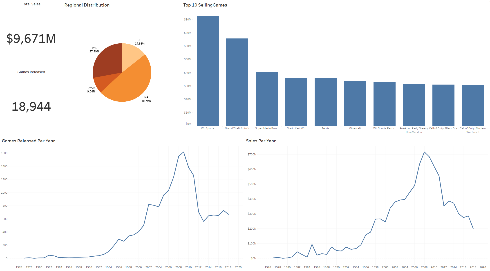
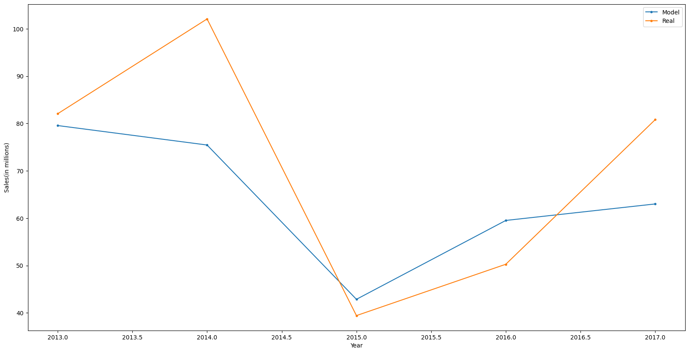

# VGChartz Database EDA
## Project Background

This project explores historical trends in video game sales, providing insights into market dynamics to forecast future trends and guide strategic recommendations.The data used in this analysis is pulled from a public database at [VGChartz.com](https://www.vgchartz.com/games/games.php?page=1&results=1000&order=TotalSales&ownership=Both&direction=DESC&showtotalsales=1&shownasales=1&showpalsales=1&showjapansales=1&showothersales=1&showpublisher=1&showdeveloper=1&showreleasedate=1&showlastupdate=0&showvgchartzscore=0&showcriticscore=1&showuserscore=1). This is a website dedicated to tracking and archiving data related to video games and their sales data.

Insights and recommendations are provided on the following key areas:

+ Overall Sales
+ Regional Sales
+ Genre and Platform Performance
+ Publisher Performance

Interactive Tableau dashboards can be accessed [here](https://public.tableau.com/app/profile/giovanni.pecorino/viz/VGChartzvDashboards/SalesOverview?publish=yes).  
The Python file used to web scrape the data from VGChartz.com can be found [here](https://github.com/gpecorino/Vgchartz_Data_Exploration/blob/main/vgchartz_webscrape.py).  
The Jupyter Notebook that contains the exploratory analysis and machine learning model can be found [here](https://github.com/gpecorino/Vgchartz_Data_Exploration/blob/main/vgchartz_eda_ml.ipynb).

## About the Dataset

The dataset pulled from [VGChartz.com](https://www.vgchartz.com/games/games.php?page=1&results=1000&order=TotalSales&ownership=Both&direction=DESC&showtotalsales=1&shownasales=1&showpalsales=1&showjapansales=1&showothersales=1&showpublisher=1&showdeveloper=1&showreleasedate=1&showlastupdate=0&showvgchartzscore=0&showcriticscore=1&showuserscore=1) contained the first 19000 entries. All data after this point was missing, thus it was omitted from further analysis. The dataset has 12 features:
1. Rank - Order of games in list based on Global Sales in descending order
2. Name - Name of game
3. Publisher - Publisher that released game
4. Developer - Developer that created game
5. Platform - Console that the game was on
6. Release_date - Year of games release
7. Genre - Genre of game
8. Sales_NA - Sales in the North American region
9. Sales_PAL - Sales the in PAL region which include Europe, New Zealand, Australia, India, Middle East and South Africa.
10. Sales_JP - Sales in Japan
11. Sales_Others - Sales from other regions not already covered
12. Sales_Globe - Total sales from all regions

## Executive Summary

### Overview of Findings

Overall game sales peaked in 2008, followed by a significant decline in the subsequent years. While the industry has yet to fully recover to this peak, aligning with current consumer preferences remains a key strategy for success. Fast-paced genres, such as sports, shooters, and action games, continue to attract high sales and widespread engagement. Additionally, the sustained success of major publishers like Nintendo and popular franchises such as Grand Theft Auto highlights the powerful role of brand recognition and consumer loyalty in driving consistent sales.

My machine learning model uses data from 2013-2017, the last 5 years of available data. I limit it to this window to isolate recent trends and avoid being influenced by older ones. The model captures some of the trends present in the data, as illustrated in the graph below. Although the R-squared value for this model is low, this model serves as a solid starting point. While there are potential improvements, the model's performance is constrained by the limitations of the data. The dataset contains only a few usable variables, which makes it challenging to capture more nuanced trends. I further discuss ways in which this model could be improved in the **Area for Improvement** section. 

## Technologies

+ Python: Primary language used for webscrapping and data processing/analysis
+ Pandas: Used for data manipulation and analysis
+ Matplotlib: Used for data visualization
+ BeautifulSoup: Used for reading html for webscrapping

## Areas for Improvement

There are still ways in which this project could be improved upon.

The first area for improvement is the webscrapping code. When running this code over an extended period of time, connection to the database was occasionally lost. Depending on the size of the data however, this may not be a persistent issue. The simplest solution I found was to add the data that had been previously scrapped to the csv file before running the code again from the last complete entry, repeating the cycle until all the desired data was acquired. While this solution was successful, in the future I would like to find a way to maintain a stable connection to the database for a longer period of time, as well as reduce the overall runtime of the code. Doing so would result in this script only needing to be ran once.

The second area for improvement is my machine learning model. Several strategies could potentially enhance its performance:
1. **Increase the Amount of Data**: Including data from additional years could provide the model with more information, enhancing its ability to identify trends. However, this approach risks incorporating outdated trends that may not be relevant today, potentially biasing the model and decreasing its performance.
2. **Better Handling of Missing Data**: In this analysis, I dropped all rows with missing data, which reduced the dataset's size. Developing a method to impute these missing values with reasonable estimates could increase efficiency. Relying too heavily on imputed data might lead the model to detect false trends.
3. **Feature Engineering**: Creating new features from the existing data could enrich the dataset without depending on speculative values. Despite this potential, the limited number of original variables poses a challenge in generating additional meaningful features.

While there are various approaches to enhance the model, careful implementation is crucial. Each method comes with its own set of risks, and improper application could inadvertently degrade the model's performance.
