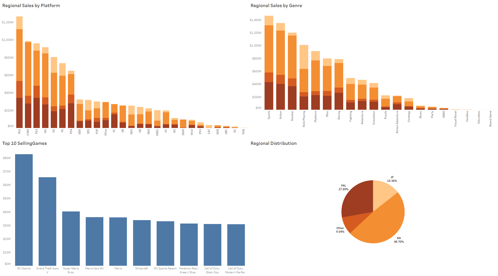
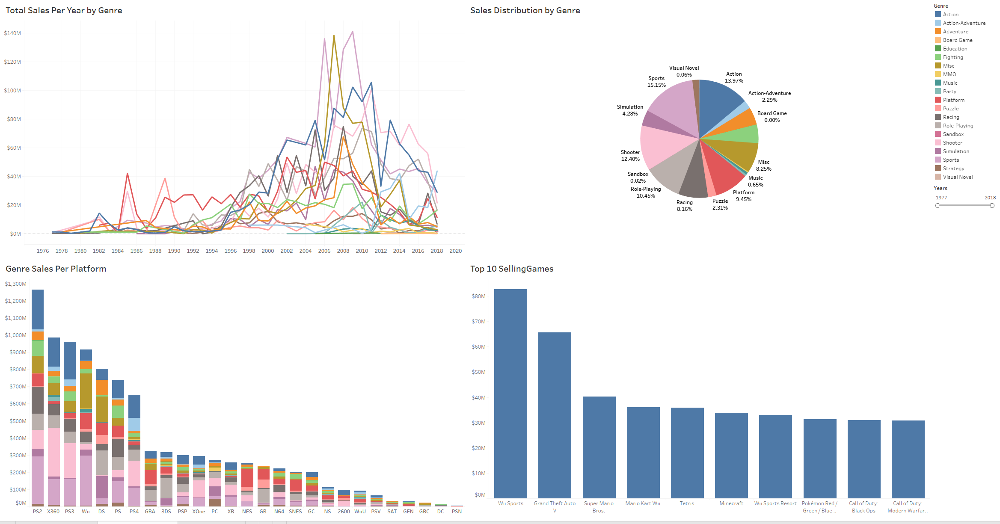
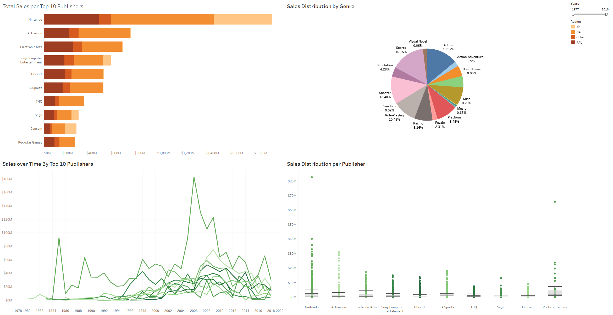

# VGChartz Database EDA
## Project Background

This project explores historical trends in video game sales, providing insights into market dynamics to forecast future trends and guide strategic recommendations.The data used in this analysis is pulled from a public database at [VGChartz.com](https://www.vgchartz.com/games/games.php?page=1&results=1000&order=TotalSales&ownership=Both&direction=DESC&showtotalsales=1&shownasales=1&showpalsales=1&showjapansales=1&showothersales=1&showpublisher=1&showdeveloper=1&showreleasedate=1&showlastupdate=0&showvgchartzscore=0&showcriticscore=1&showuserscore=1). This is a website dedicated to tracking and archiving data related to video games and their sales data.

Insights and recommendations are provided on the following key areas:

+ **Overall Sales and Release trends:** Analyzing historical patterns in video game sales and release trends over time.
+ **Regional Comparisons:** A detailed analysis of sales across different genres and platforms by region.
+ **Genre and Platform Performance:** An evaluation of how genre sales have evolved over time and how different genres perform across various platforms.
+ **Publisher Performance:** An assessment of the most successful publishers and the types of games they produce.

Interactive Tableau dashboards can be accessed [here](https://public.tableau.com/app/profile/giovanni.pecorino/viz/VGChartzvDashboards/SalesOverview?publish=yes).  
The Python file used to web scrape the data from VGChartz.com can be found [here](https://github.com/gpecorino/Vgchartz_Data_Exploration/blob/main/vgchartz_webscrape.py).  
The Jupyter Notebook that contains the exploratory analysis and machine learning model can be found [here](https://github.com/gpecorino/Vgchartz_Data_Exploration/blob/main/vgchartz_eda_ml.ipynb).

## About the Dataset

The dataset pulled from [VGChartz.com](https://www.vgchartz.com/games/games.php?page=1&results=1000&order=TotalSales&ownership=Both&direction=DESC&showtotalsales=1&shownasales=1&showpalsales=1&showjapansales=1&showothersales=1&showpublisher=1&showdeveloper=1&showreleasedate=1&showlastupdate=0&showvgchartzscore=0&showcriticscore=1&showuserscore=1) contained the first 19000 entries. All data after this point was missing, thus it was omitted from further analysis. The dataset has 12 features:
1. Rank - Order of games in list based on Global Sales in descending order
2. Name - Name of game
3. Publisher - Publisher that released game
4. Developer - Developer that created game
5. Platform - Console that the game was on
6. Release_date - Year of games release
7. Genre - Genre of game
8. Sales_NA - Sales in the North American region
9. Sales_PAL - Sales the in PAL region which include Europe, New Zealand, Australia, India, Middle East and South Africa.
10. Sales_JP - Sales in Japan
11. Sales_Others - Sales from other regions not already covered
12. Sales_Globe - Total sales from all regions

## Executive Summary

### Overview of Findings

Overall game sales peaked in 2008, followed by a significant decline in the subsequent years. While the industry has yet to fully recover to this peak, aligning with current consumer preferences remains a key strategy for success. Fast-paced genres, such as sports, shooters, and action games, continue to attract high sales and widespread engagement. Additionally, the sustained success of major publishers like Nintendo and popular franchises such as Grand Theft Auto highlights the powerful role of brand recognition and consumer loyalty in driving consistent sales.

## Insights

### Overall Sales

+ **After a peak in 2008, there was a sharp decline in both the number of games released and overall sales.** With the North American market accounting for 48.68% of global sales, it is likely that the 2008 U.S. recession contributed significantly to this downturn. This impact becomes even clearer when examining annual sales trends in North America alongside those in other regions.
+ **The top 10 best-selling games are all from well-known franchises, with six of them belonging to fast-paced genres like sports and shooters.** This trend underscores the appeal of established brands and action-oriented gameplay in driving high sales.
  + *Wii Sports* was bundled with the Wii console in all regions outside of Japan, with its exceptional success largely attributed to the Wii’s widespread popularity rather than the game’s standalone appeal.

### Regional Sales

+ North America is a dominant region for video game sales containing 48.68% of total sales.
+ Although the Japanese market represents only 14.4% of global sales, it’s notable that this figure reflects sales from a single country, whereas other regions encompass multiple countries.
+ **Fast-paced genres like Sports, Action, Shooters and Racing are top performers** in North America, European and Other markets.
+ **In Japan, Role-Playing Games (RPGs) lead the market with $374 million in sales, significantly outperforming the next best-selling genre, Sports, by 151%.** This preference is also reflected in the success of *Pokémon*, Japan's top-selling game, which surpasses popular global titles like *Call of Duty* and *Grand Theft Auto V* that otherwise outperform *Pokémon* in all other regions.
+ PlayStation platforms lead game sales across European countries, with the PS3 as the top-performing platform at $342.2 million in sales. Its nearest competitor, the Xbox 360, **trails by 28% with $275.7 million in sales.**
+ **North America showcases greater diversity in gaming platforms**, with Xbox, PlayStation, and Nintendo all represented in the top three. The Xbox 360 leads with $609.2 million in sales, followed closely by the PS2 at $588 million and the Wii at $500.3 million.
+ **In Japan, Nintendo and PlayStation platforms dominate game sales,** with the Nintendo DS leading at $178.4 million, followed by PlayStation at $143.2 million. In contrast, the highest-performing Xbox platform, the Xbox 360, lags significantly behind at just $12.8 million. This disparity may be attributed to the fact that both Nintendo and Sony are Japanese companies.

### Genre and Platform Performance

+ **Many of the top-performing genres feature fast-paced game mechanics,** with sports, shooters, action, platformers, and racing dominating the market.
+ While most genres have experienced declining sales in recent years, several, such as Action-Adventure, Fighting, Racing, and Platformer games, are showing signs of growth. **These are the only genres to record an increase in sales between 2016 and 2018.**
+ Many of the top performing genres such as Sports, Action, Racing and Shooters perform best on Playstation and XBox platforms.
+ **Certain genres, including Role-Playing, Puzzles, and Platformers, tend to perform better on Nintendo platforms.** This success can be attributed to Nintendo's strong exclusive franchises in these genres, such as *Pokémon* for Role-Playing games and *Super Mario Bros.* and *Donkey Kong* for Platformers.
+ In PC gaming, Shooters remain a top-performing genre, but Simulation and Strategy games are also significantly more represented compared to other platforms. **Simulation games account for 21.11% of sales on PC, in stark contrast to just 4.28% across all platforms, while Strategy games make up 16.93% on PC, compared to only 1.86% across all platforms.**
+ Five of the top ten best-selling games are exclusive titles from Nintendo, including *Wii Sports* and *Super Mario Bros*. In contrast, the other top performers, such as *Minecraft*, *Grand Theft Auto V*, and both *Call of Duty titles*, are available across multiple platforms.

### Publisher Performance

+ **Nintendo is the top-performing publisher, with sales reaching $1.899 billion,** and has consistently held this position as the leading publisher nearly every year.
+ **Many publishers depend significantly on a few established franchises to generate the majority of their sales.** Nintendo, for instance, heavily relies on iconic franchises such as *Mario Bros.*, *The Legend of Zelda*, and *Pokémon*, while Rockstar Games focuses predominantly on the *Grand Theft Auto franchise*.
+ The Japanese market significantly impacts publishers such as Nintendo, Sony, Sega, and Capcom, while other publishers receive minimal contributions from Japanese sales. This disparity is likely due to the fact that these companies are based in Japan, allowing them to better align with local consumer preferences.
+ Publishers like Activision, Ubisoft, and EA excel in North America and Europe, primarily due to their focus on popular genres such as Shooting, Sports, and Racing, which dominate the gaming landscape in these regions.

## Recommendations

Based on the insights and findings above, the following recommendations have been provided:
+ **Capitalize on the strong and consistent performance of Sports games, which account for 15.15% of all game sales** and are the top-performing genre in every region except Japan. Additionally, Sports games have the advantage of releasing new iterations annually, aligning with the start of each sport's season.
+ To expand in the Japanese market, consider incorporating mechanics popular in Role-Playing games and forming strategic partnerships with Nintendo or Sony. Role-Playing games are highly successful in Japan, generating $374 million in sales, outpacing the next best-performing genre by 151%. **Collaborating with Nintendo or Sony would be advantageous, as they are the top publishers in Japan, and games on their platforms consistently outperform those on any Xbox platform.**
+ **Invest into making games in genres that are growing in popularity.** Action-Adventure and Fighting are the only genres that saw an increase in sales across the last 2 years of available data. Sales for Action-Adventure games increased by 144% from 2017 to 2018, while the Fighting genre saw an increase of 54.55%. Capitalizing on this trend now may allow us to become a strong presence in the genres before they become oversaturated with options.
+ Seek opportunities to partner with established franchises such as Call of Duty, Grand Theft Auto, Super Mario Bros., and Pokémon. These franchises consistently perform well and boast large, loyal player bases. **Associating with these renowned brands can help attract customers from their dedicated fan communities.**

## Machine Learning Model

The machine learning model uses data from 2013-2017, the last 5 years of complete available data. It is limited to this window to isolate recent trends and avoid being influenced by older ones. The model captures some of the trends present in the data, as illustrated in the graph below. Although the R-squared value for this model is low, this model serves as a solid starting point. While there are potential improvements, the model's performance is constrained by the limitations of the data. The dataset contains only a few usable variables, which makes it challenging to capture more nuanced trends. I further discuss ways in which this model could be improved in the **Area for Improvement** section. 

## Assumptions and Caveats:

Throughout the analysis, multiple assumptions were made to manage challenges with the data. These assumptions and caveats are noted below:
+ It is important to note that the data used by VGChartz is based on estimates and may not always accurately reflect official sales figures.
+ The data for more recent years is incomplete, with 2017 and 2018 being the last years for which we have seemingly complete information.
+ For this analysis, we assume that the majority of a game’s sales occur in the year of its release. The data provided includes total lifetime sales but does not break down yearly sales. Consequently, if a game was released in 2005 but recorded sales in 2007, all sales would be attributed to 2005, inflating the figures for that year.

## Areas for Improvement

There are still ways in which this project could be improved upon.

The first area for improvement is the webscrapping code. When running this code over an extended period of time, connection to the database was occasionally lost. Depending on the size of the data however, this may not be a persistent issue. The simplest solution I found was to add the data that had been previously scrapped to the csv file before running the code again from the last complete entry, repeating the cycle until all the desired data was acquired. While this solution was successful, in the future I would like to find a way to maintain a stable connection to the database for a longer period of time, as well as reduce the overall runtime of the code. Doing so would result in this script only needing to be ran once.

The second area for improvement is my machine learning model. Several strategies could potentially enhance its performance:
1. **Increase the Amount of Data**: Including data from additional years could provide the model with more information, enhancing its ability to identify trends. However, this approach risks incorporating outdated trends that may not be relevant today, potentially biasing the model and decreasing its performance.
2. **Better Handling of Missing Data**: In this analysis, I dropped all rows with missing data, which reduced the dataset's size. Developing a method to impute these missing values with reasonable estimates could increase efficiency. Relying too heavily on imputed data might lead the model to detect false trends.
3. **Feature Engineering**: Creating new features from the existing data could enrich the dataset without depending on speculative values. Despite this potential, the limited number of original variables poses a challenge in generating additional meaningful features.

While there are various approaches to enhance the model, careful implementation is crucial. Each method comes with its own set of risks, and improper application could inadvertently degrade the model's performance.

## Technologies

+ Python: Primary language used for webscrapping and data processing/analysis
+ Pandas: Used for data manipulation and analysis
+ Matplotlib: Used for data visualization
+ BeautifulSoup: Used for reading html for webscrapping
